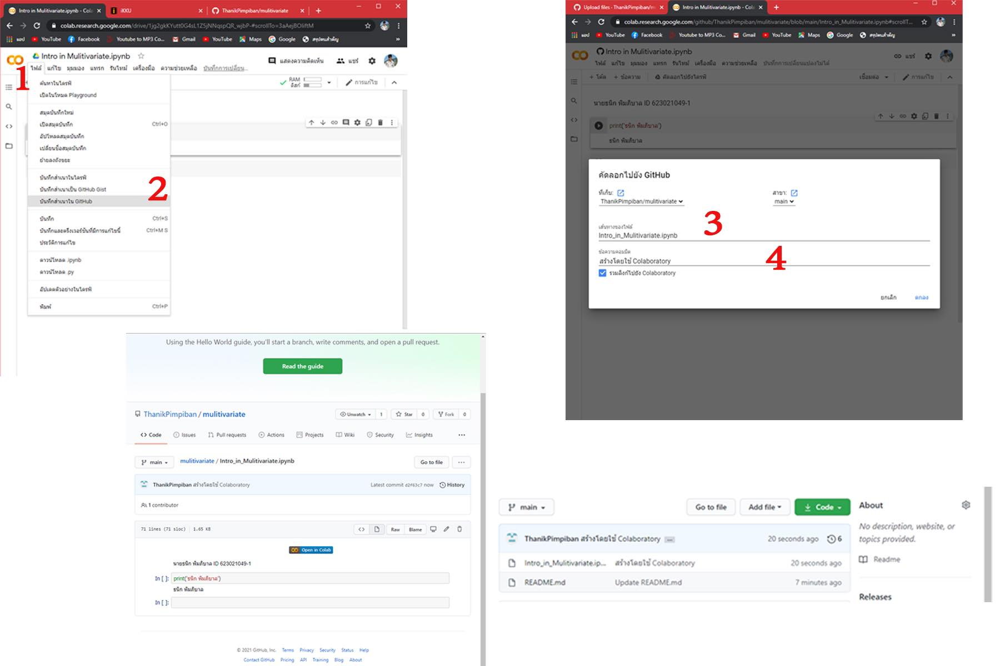

# Multivariate

### ศิริวัฒน์ ภูลำสัตย์ ID 623020765-0

.md => Markdown

อธิบายการใช้งาน Github เเละ Google Colab ว่าหน้าที่ของเเต่ละอันคืออะไร เเละอธิบายวิธีเซฟไฟล์จาก Google Colab ลงใน Github

### Github

เป็นแหล่งในการรวมโค้ดไฟล์ที่สามารถเเชร์ให้้อื่นเข้ามาทำการเเก้ไขโค้ดหรือดูโค้ดที่เราเขียนได้

### Google Colab

เป็นโปรเเกรมอินเตอร์เฟสที่ใช้ในการเขียนโค้ด

### การเซฟไฟล์จาก Google Colab ลงใน Github

มีขั้นตอนคือ 1.file --> 2.บันทึกสำเนาใน github --> 3.ตั้งชื่อไฟล์ --> 4.ใส่ comment --> เส็จขั้นตอน

